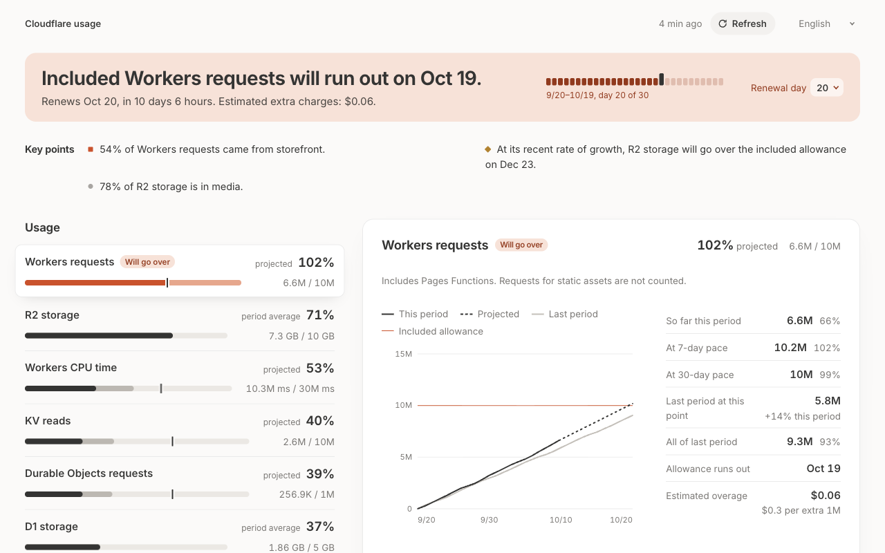

# Usage

¿Tu cuenta de Cloudflare se mantendrá dentro de tu plan Workers Paid en este período de facturación, y cuánto costará si no?

[](https://deploy.workers.cloudflare.com/?url=https://github.com/sz-ws/usage)

[English](../../README.md) · [繁體中文](README.zh-TW.md) · [简体中文](README.zh-CN.md) · [日本語](README.ja.md) · [한국어](README.ko.md) · **Español** · [Français](README.fr.md) · [Deutsch](README.de.md) · [Português](README.pt-BR.md)



Un Worker en tu propia cuenta de Cloudflare. Lee el uso de la cuenta desde Cloudflare Analytics, lo compara con lo que incluye el plan y proyecta en qué punto estará cada producto al cerrar el período. Léelo en una página, obtenlo como JSON o deja que un agente lo consulte por MCP. Nada sale de tu cuenta: no hay telemetría ni ningún servicio de terceros.

## Lo que te dice

- **Si vas a superar el límite incluido.** Solicitudes de Workers y tiempo de CPU, D1, KV, R2, Durable Objects, Queues y Workers AI: lo usado hasta ahora, lo incluido y la previsión para el final del período de facturación.
- **Cuánto costará.** El exceso en dólares, según las listas de precios de Cloudflare.
- **Quién lo usa.** Cada cifra por Worker, base de datos, espacio de nombres, bucket, cola o modelo.
- **Qué ha cambiado.** Un Worker cuyas solicitudes se triplicaron esta semana. Un almacenamiento que superará su límite incluido dentro de 40 días.
- **Cuándo revisarlo.** Una notificación por ntfy o webhook cuando un producto vaya camino de superar su límite incluido.
- **Varias cuentas**, una pestaña para cada una.
- **Nueve idiomas.**

## Pruébalo sin cuenta

```sh
git clone https://github.com/sz-ws/usage && cd usage
pnpm install
pnpm demo        # datos ficticios en http://localhost:8798
```

## Despliegue

Necesitas una cuenta de Cloudflare en **Workers Paid**. Ejecutarlo no cuesta nada además de eso: lee Cloudflare cuatro veces al día y guarda el resultado en KV, una pequeña fracción de lo que ya incluye el plan.

1. **Pulsa Deploy to Cloudflare.** Crea el espacio de nombres de KV que necesita y te pide dos secretos.
   - `ANALYTICS_TOKEN`: un token de API con un solo permiso, **Account Analytics: Read**. [Este enlace](https://dash.cloudflare.com/?to=/:account/api-tokens&permissionGroupKeys=%5B%7B%22key%22%3A%22account_analytics%22%2C%22type%22%3A%22read%22%7D%5D&name=usage) rellena el formulario. El token muestra cuánto se ha usado y nada de lo que está guardado: no puede leer una base de datos, un valor de KV ni un objeto de R2, y tampoco puede cambiar nada.
   - `ACCESS_KEY`: la contraseña de tu página, de 24 caracteres o más. `openssl rand -base64 32` genera una.
2. **Abre la dirección del Worker** e inicia sesión con la clave de acceso.
3. **Configura el día en que se renueva tu factura.** Está en Manage Account → Billing → Subscriptions, en el dashboard de Cloudflare.

Desde un clon, con varias cuentas o con tu propio dominio: [docs/deploy.md](../deploy.md) (en inglés).

## Conectar un agente

El Worker también es un servidor MCP en `https://<your-worker>/mcp`. En Claude, añade esa dirección como conector personalizado. En Claude Code:

```sh
claude mcp add --transport http usage https://<your-worker>/mcp
```

Tu Worker te pedirá que inicies sesión y lo permitas, y el agente recibirá un token de solo lectura propio. Otros clientes, las herramientas y la API JSON: [docs/agents.md](../agents.md) (en inglés).

## Documentación

Los siguientes documentos están en inglés.

- [Despliegue y configuración](../deploy.md)
- [Agentes, MCP y la API JSON](../agents.md)
- [Alertas por ntfy o webhook](../alerts.md)
- [Cómo funciona y de dónde salen las cifras](../how-it-works.md)
- [Desarrollo y cómo añadir un idioma](../development.md)

## Licencia

[Apache-2.0](../../LICENSE)
